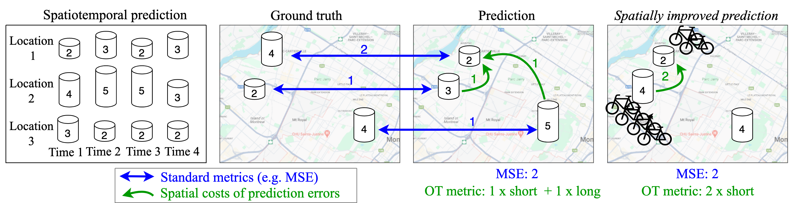

[](https://s3.us-east-1.amazonaws.com/climate-change-ai/papers/iclr2024/41/paper.pdf)

# GEOT: Optimal transport for evaluating geospatial predictions

This repo contains code to evaluate spatiotemporal predictions with Optimal Transport (OT). In contrast to standard evaluation metrics (MSE, MAE etc), the OT error is a *spatial* metric that evaluates the spatial distribution of the errors.



Explanation:
* Assume we want to predict some observations in several locations, e.g., bike sharing demand at bike sharing stations, over time
* Usually, the error is just averaged over locations (MSE between GT and prediction)
* However, in real-world applications, there are distance-based costs involved with prediction errors. For example, prediction errors cause costs for relocating bikes
* Assue we can define a *cost matrix* with the pairwise costs between locations, indicating the cost to account for errors
* With Optimal Transport, we can compute the minimum costs for transforming the predictions to the ground truth - a better indicator for the real-world costs of prediction errors than just the MSE

With this code, you can compute the OT error for your predictions. The input is usually just the `observations` at a set of location, the `predictions` and the `cost matrix`. The output is the OT error (a single number) or the optimal transport matrix T.

## Install

```
git clone https://github.com/mie-lab/geospatialOT.git
cd geospatialOT
conda create -n geot_env
conda activate geot_env
pip install .
```

If you have Cuda available, make sure to install [torch](https://pytorch.org/get-started/locally/) with GPU support instead. 

## Tutorial

Check out our [tutorial](tutorial.ipynb) to get started with a simple example.